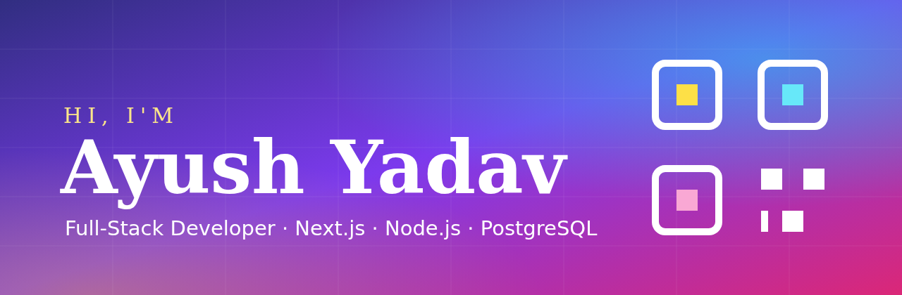

<div align="center">



<br/>


<br/>
<br/>

[](https://github.com/ayush8620)

</div>

---

<div align="center">

## Know About Me

</div>

Hey, I am **Ayush Yadav**, a full-stack web developer and B.Tech CSE student from Prayagraj, India.

I build practical web software: responsive Next.js and React front ends, Node.js and Express APIs, PostgreSQL and Firestore data layers, secure authentication flows, and PWAs that work offline. I also interned as a Full Stack Developer at **Crensa Studio**, where I worked on PWA and service workers, UI, and API integration.

Security is my second lane. I study web security with Burp Suite, Nmap, Wireshark and the OWASP Top 10, and I bring that mindset into every app I build.

<div align="center">

[](https://ayushyadav.dev)

</div>

---

<div align="center">

## Top Projects

</div>

<table>
<tr>
<td width="50%">

### Vynco

Mobile-first networking platform with QR digital business cards, Firebase phone OTP login with invisible reCAPTCHA, a real-time connection system on Firestore, and rate limiting.

```text
Next.js / Tailwind / Framer Motion
Firebase Auth / Firestore
```

[](https://linkllyapp.in)

</td>
<td width="50%">

### INNOHUB

Full-stack platform that connects innovators and investors, with secure authentication and a responsive dashboard.

```text
React / Firebase
auth + investor matching
```

[](https://innohub-azure.vercel.app)

</td>
</tr>
<tr>
<td width="50%">

### Campus Lens

Campus web app built in TypeScript and deployed on its own domain.

```text
TypeScript / Next.js
campus.phoenixty.me
```

[](https://campus.phoenixty.me) [](https://github.com/ayush8620/campus-lens)

</td>
<td width="50%">

### Student Record Management

ERP-style system to manage student records, built for real campus use.

```text
JavaScript / ERP dashboard
erp.phoenixty.me
```

[](https://erp.phoenixty.me) [](https://github.com/ayush8620/Student-Record-Management)

</td>
</tr>
<tr>
<td width="50%">

### CRENSA PWA

Progressive web app work from my Crensa Studio internship: installable UI, service workers and offline caching.

```text
TypeScript / PWA
service workers
```

[](https://github.com/ayush8620/CRENSA-PWAA)

</td>
<td width="50%">

### TalentDash

Talent dashboard web app built with TypeScript and deployed on Vercel.

```text
TypeScript / Vercel
dashboard UI
```

[](https://telent-dash.vercel.app) [](https://github.com/ayush8620/TelentDash)

</td>
</tr>
</table>

---

<div align="center">

## Stack


<br/>
<br/>


</div>

---

<div align="center">

## Activity


<br/>


</div>

---

<div align="center">

## Connect

[](https://ayushyadav.dev)
[](https://linkedin.com/in/ayush-yadav-6a0525320)
[](https://instagram.com/ayush__yadav8620)
[](https://www.fiverr.com/ayushyadav8620)
[](mailto:yadavaayush8484@gmail.com)

<br/>
<br/>

> Code is not finished when it compiles. It is finished when users can run it, trust it, and keep using it.

</div>

---

<div align="center">

<sub>Full Stack / Web Security / Products</sub>

<br/>
<br/>


</div>
